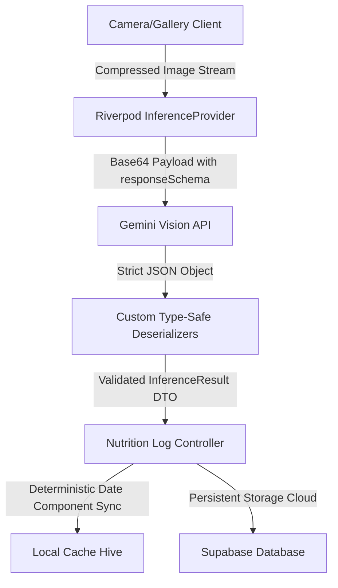

<table align="center">
  <tr>
    <td align="center">
      <a href="https://flutter.dev">
        
      </a>
    </td>
    <td align="center">
      <a href="https://dart.dev">
        
      </a>
    </td>
    <td align="center">
      <a href="https://supabase.com">
        
      </a>
    </td>
    <td align="center">
      <a href="https://deepmind.google/technologies/gemini/">
        
      </a>
    </td>
  </tr>
</table>

<h1 align="center">DietLog: AI-Powered Nutrition Orchestration</h1>

<p align="center">
  <a href="https://github.com/Osamsami/dietlog/actions/workflows/flutter_ci.yml">
    
  </a>
</p>

<p align="center">
  <strong>A production-grade, high-fidelity Health & Fitness platform built with Clean Architecture, leveraging multimodal AI analysis and deterministic state management to automate dietary logging.</strong>
</p>

---

## 🚀 Project Perspective

### What is DietLog?
DietLog is an enterprise-tier AI orchestration engine for automated nutrition logging. It bypasses conventional manual calorie tracking by translating raw multi-resolution camera streams into real-time, actionable macro-nutritional telemetry.

### Core Technical Capabilities
* **Multimodal Feature Extraction:** Streams client-side compressed camera/gallery frames to the Gemini Vision API via optimized Base64 payloads to instantly evaluate diverse food items.
* **Strict Schema Inference:** Enforces rigid `responseSchema` guardrails directly on the LLM runtime to guarantee the extraction of structured JSON telemetry (Calories, Proteins, Carbs, Fats) with runtime validation scores.
* **Type-Safe Fail-Safes:** Implements highly resilient deserialization hooks within the data transition layer to prevent system crashes caused by dynamic runtime casting errors (`int` vs `double`).
* **Synchronous Cloud Authentication:** Utilizes Supabase Auth with cached session pointers to ensure zero-latency application routing and encrypted asset access control.
* **Hybrid Data Persistence Layer:** Syncs local NoSQL Hive caching engines for instant offline data rehydration alongside persistent remote Supabase PostgreSQL storage buckets.
* **Deterministic Local Time Matching:** Bypasses distributed cloud timezone/UTC discrepancies using explicit device-side date element evaluations (`year, month, day`) to power real-time historical filtering.

---

## 🛠 Architecture & Tech Stack



Built strictly upon the fundamentals of **Clean Architecture** combined with the **Repository Pattern** to split systemic concerns cleanly across decoupled layers:

* **Frontend & State Topology:** Cross-platform Flutter engine powered by declarative Riverpod data streams and reactive StateNotifiers.
* **AI & Inference Pipeline:** Google Gemini Vision API executing network telemetry through structured Dio client layers.
* **Backend Infrastructure (BaaS):** Supabase orchestration featuring real-time relational PostgreSQL databases, Row-Level Security (RLS) policies, and secure bucket storage.
* **Caching & Local Querying:** Lightweight Hive local memory registers managing instant cryptographic key-value pair transactions.

---

## 📂 System Directory Layout

```text
lib/
├── core/                  # Shared system drivers, design configurations, and network engines
│   ├── network/           # Gemini API gateways and network clients
│   └── utils/             # Cryptographic operations, formatters, and global constraints
├── data/                  # Abstract configurations and raw state management engines
│   ├── models/            # Data Transfer Objects (DTOs) and type-safe data deserializers
│   └── repositories/      # Implementations of cloud/local concrete persistence layer actions
├── logic/                 # High-level business behavior rule configurations
│   └── providers/         # Riverpod dependency graphs and filter state streams
└── presentation/          # Decoupled UI controls and view-model tracking layers
    ├── dashboard/         # Real-time state metrics UI and camera canvas streams
    ├── history/           # Log evaluation views and analytical graphs
    └── profile/           # Local account data preferences and system key maps
```

---

## ⚙️ Deployment & Compilation Pipeline

### System Prerequisites
* **Flutter SDK:** Version 3.x.x+ (Stable Channel)
* **Dart SDK:** Configured within system paths
* **Database Infrastructure:** Configured Supabase project containing operational storage buckets and database schemas

### Compilation Sequence

1. **Clone and Initialize Environment Workspace**
   ```bash
   git clone [https://github.com/Osamsami/dietlog.git](https://github.com/Osamsami/dietlog.git)
   cd dietlog
   ```

2. **Acquire Package Signatures**
   ```bash
   flutter pub get
   ```

3. **Establish Runtime Environment** Generate a secure configuration file named `.env` in the root repository path:
   ```env
   SUPABASE_URL="[https://your-project.supabase.co](https://your-project.supabase.co)"
   SUPABASE_ANON_KEY="your-anon-key"
   GEMINI_API_KEY="your-gemini-key"
   ```

4. **Execute Native Production Compilations** To build an optimized, highly performant Android release binary featuring Ahead-Of-Time (AOT) compiler optimizations, run:
   ```bash
   flutter build apk --release
   ```

---

## 🧠 Engineering Leadership

The DietLog ecosystem was architected with a strict focus on high-precision state management, secure database interactions, and seamless AI workflows.

* **Osam Sami** - *System Architect & AI/ML Lead*
  * Engineered the generative AI Inference Pipeline, implemented Clean Architecture scaffolding, and deployed the Cloud Database Infrastructure.

---
<div align="center">
  <i>DietLog: Precision in Every Pixel, Nutrition in Every Scan.</i>
</div>
```
